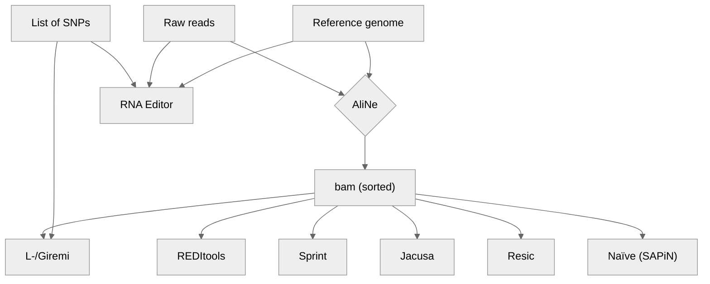
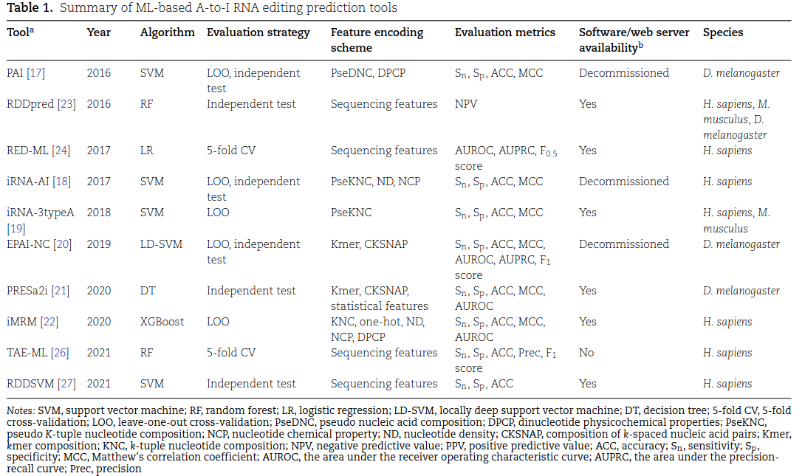
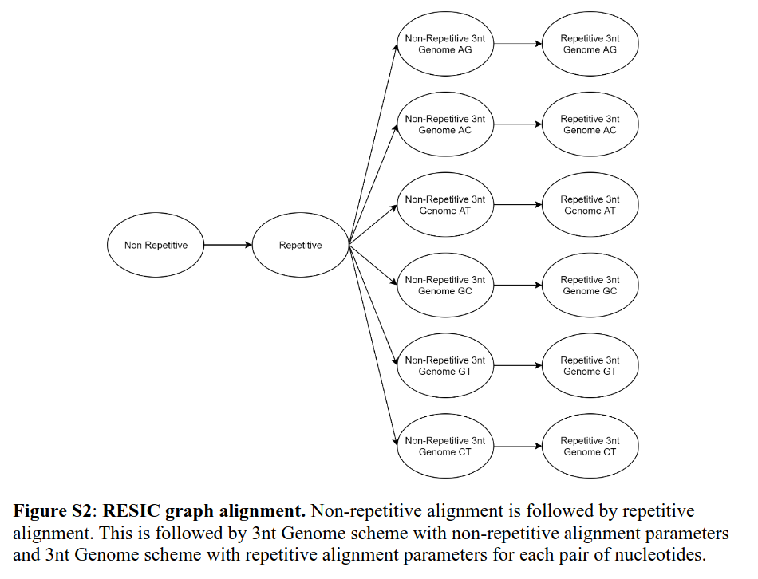
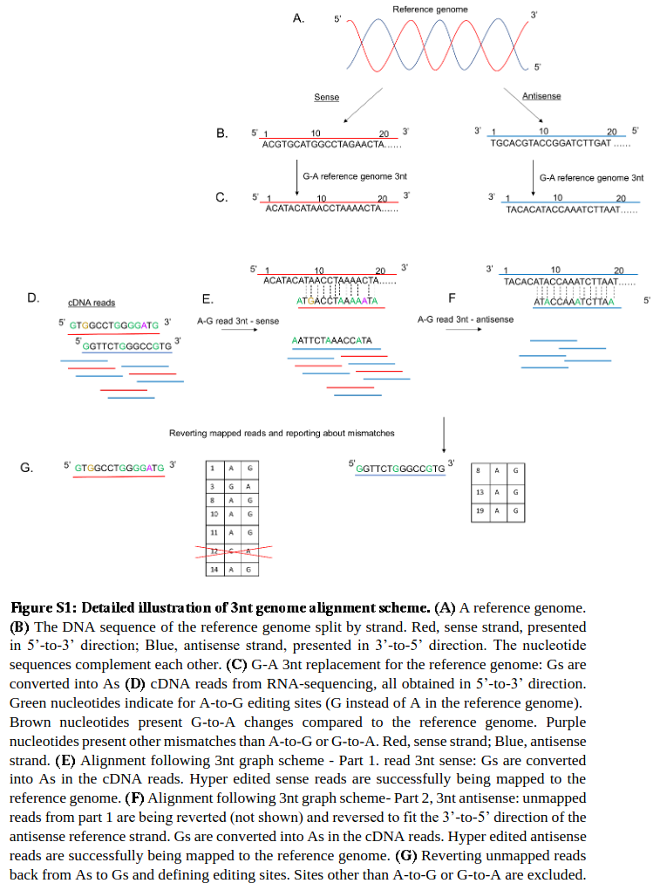

# Editing_knowledge

Gathering knowledge about Adenosine (A) to Inosine (i) RNA Editing, a.k.a. A-to-I editing.

---------------------------
 

## Pipeline

### Sketch

Lo Giudice et al. [@picardi2021] recommend the use of Blat to refine the alignment:
> “In particular, mapping errors, that are quite frequent and represent the first source of false RNA editing calls, should be mitigated realigning with Blat [18] those reads carrying higher numbers of mismatches.”
> (“RNA Editing: Methods and Protocols”, 2021, p. 195)

### Mapping

> “An essential parameter regarding the mapping step is to keep only the uniquely mapping reads, avoiding the reads that map in more than one genomic location [57,58]” (Bortoletto and Rosani, 2024, p. 6)

## Evaluation

### Simulations

InSilicoSeq

@peng2012 describe this simulation procedure:

>1. Use chromosome 1 of the NCBI human RefSeq as a reference and pro-
duce an identical copy of the corresponding transcriptome sequence.
>2. Two sets of simulated data were created. In the first set, SNVs were ran-
domly generated in the copy sequence by MAQ43 with default options.
In the other simulated set, only A→G substitution at positions that are
referenced in the DARNED database9 (814 sites total for coding regions
of chromosome 1) were introduced.
>3. Reads were generated from random locations for both forward and
reverse strands of the copy; 5-, 10-, 20-, and 50-fold coverage reads
were generated for the random-sites data, 50-fold coverage reads for the
DARNED data sets.
>4. Both data sets were subjected to read alignment and SNV calling as
described below. Results from each step of the analysis were compared
with the known types and positions of simulated SNVs and used to
evaluate our SNV calling approach (Fig. 1c, Supplementary Fig. 2 and
Supplementary Tables 4 and 5).

## Use ideas

### Descriptive statistics

### Enrichment analysis

## Approaches

- **Known**: Match mapped reads against a list of "known" edits from a database (e.g. REDIportal).
- **DNA-RNA**: Compares DNA and RNA sequences from the same individual
- **De novo**: Uses RNA-seq data only

## Tools

| Name                    | Year | Publication    | Repo                                              | In Bioconda | Container |
| :---------------------- | :--- | :------------- | ------------------------------------------------- | ----------- | - |
| [Reditools](#reditools) | 2013 | @picardi2013   | [Link](https://github.com/BioinfoUNIBA/REDItools) | No (v1.0.4 only in mtangaro channel) |   |
| Giremi                  | 2015 | @zhang2015     | [Link](https://github.com/zhqingit/giremi)        | No          | - |
| RES-Scanner             | 2016 | @wang2016      | [Link](https://github.com/ZhangLabSZ/RES-Scanner) | No          |   |
| JACUSA                  | 2017 | @piechotta2017 | [Link](https://github.com/dieterich-lab/JACUSA)   | No          | - |
| Sprint                  | 2017 | @zhang2017     | [Link](https://github.com/jumphone/SPRINT)        | No          | - |
| [RESIC](#resic)         | 2021 | @light2021     | [Link](https://github.com/Lammlab/Resic)          | No          | - |
| JACUSA2                 | 2022 | @piechotta2022 | [Link](https://github.com/dieterich-lab/JACUSA2)  | No (in piechottam channel)         | - |
| L-Giremi                | 2023 | @liu2023       | [Link](https://github.com/gxiaolab/L-GIREMI)      | No          | - |
| LoDEI                | 2024 | ----       | [Link](-----)      | --          | - |

List of machine-learning methods for *predicting* editing sites from @chen2023:

# Pipeline implementation

## Resic

Resic does not expose a CLI for input; instead, the user is supposed to edit a function in Redic's source code to set up an analysis. This design hindered the incorporation of Resic to our workflow.

However, we might want to draw inspiration from Resic's alignment workflow.

## Filters

| Tool   | Read ends | Indel vicinity | Splicing vicinty | Homopolymers | SNP |
| ------ | --------- | -------------- | ---------------- | ------------ | --- |
| JACUSA | Yes       | Yes            | Yes              | Yes          | Yes |
| REDItools2 |           |                |                  |              |     |

